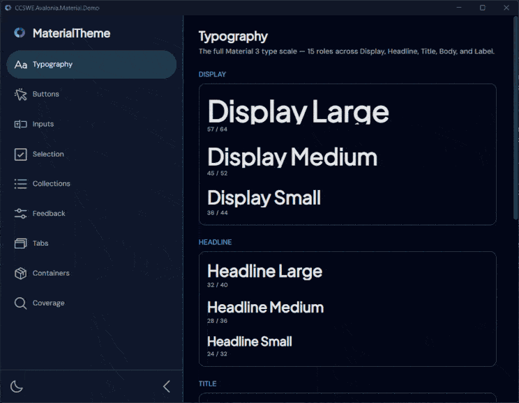

# CCSWE.Avalonia.Material

[](https://github.com/CCSWE-Avalonia/CCSWE.Avalonia.Material/actions/workflows/dotnet-build-publish-library.yml)
[](https://www.nuget.org/packages/CCSWE.Avalonia.Material)
[](https://www.nuget.org/packages/CCSWE.Avalonia.Material)
[](LICENSE.md)

A standalone **Material 3** theme for [Avalonia](https://avaloniaui.net) 12 — a
Dark/Light color system, the M3 type scale, motion, embedded brand fonts, and M3
control themes across the full surface: buttons (toggle/split/dropdown/hyperlink +
command bar + floating action button), text fields, autocomplete, numeric steppers, selection controls,
lists, tree views, dropdowns, menus, expander, cards, group boxes, dividers, sliders,
progress (linear + circular), tabs (tab control + tab strip), pips pager, tooltips, notifications, the
date family (calendar, date/time pickers), page shells, and a navigation drawer +
rail (`DrawerPage`). It depends only on **Avalonia core** — no
`FluentTheme`/`SimpleTheme` base required; it supplies the whole control surface itself.

It is the desktop sibling of the CCSWE **web** and **Android** bundles — all three
consume the same shared cross-platform design tokens. This library turns those
tokens into Avalonia `ResourceDictionary` + `Styles` and ships them as a NuGet
package.



## Install & wire up

```sh
dotnet add package CCSWE.Avalonia.Material
```

> **Versioning:** the **major version tracks the supported Avalonia major** — `12.x`
> targets **Avalonia 12.x**. Pick the major that matches your Avalonia version; minor/patch
> are this library's own features and fixes.

Then add one element to your `App.axaml` (full sample in
[`docs/samples/App.sample.axaml`](docs/samples/App.sample.axaml)):

```xml
<Application xmlns="https://github.com/avaloniaui"
             xmlns:x="http://schemas.microsoft.com/winfx/2006/xaml"
             xmlns:theme="using:CCSWE.Avalonia.Material"
             x:Class="YourApp.App"
             RequestedThemeVariant="Dark"> <!-- Dark is the CCSWE default -->

  <Application.Styles>
    <theme:MaterialTheme />
  </Application.Styles>
</Application>
```

`MaterialTheme` is standalone — it supplies the whole control surface itself and
depends only on Avalonia core. **No `<FluentTheme/>` or other base theme is required.**

## Use it

```xml
<StackPanel Spacing="12">
  <TextBlock Classes="HeadlineSmall" Text="Devices" />
  <TextBox Classes="Outlined" PlaceholderText="IP address" />
  <Button Classes="Filled" Content="Connect" />
  <Button Classes="Outlined" Content="Pair new device" />
  <CheckBox Content="Connect automatically" />
  <ToggleSwitch Content="Wireless debugging" />
  <Button Classes="Text" Content="Cancel" />
</StackPanel>
```

- **Buttons:** `Filled`, `FilledTonal`, `Elevated`, `Outlined`, `Text`, `Icon`.
- **Floating action button:** the `<theme:FloatingActionButton>` control — `Size` (`Small` / `Regular` / `Large`) and `Color` (`Primary` / `Secondary` / `Tertiary` / `Surface`) M3 mappings, with `Command` / `Click` inherited from `Button`.
- **Text fields:** `Outlined`, `Filled`.
- **Cards:** the `<theme:Card>` control for interactive cards — `Elevated` / `Filled` / `Outlined` classes, M3 hover/press state layers, and `Command` / `Click` (clickable when a `Command` is set, or `IsClickable="True"`). For a static surface, a plain `Border` with `Card` + `Elevated` / `Filled` / `Outlined` still works.
- **Divider:** the `<theme:Divider>` control — a thin M3 rule that separates content. An optional `Header` turns it into a leading section header (the label sits on the rule's axis with the hairline filling the width to its right); omit it for a plain full-width rule.
- **Navigation:** a `DrawerPage` shell with a `ListBox Classes="NavigationDrawer"` of destinations, or `Classes="NavigationRail"` for the compact 80dp rail (the active destination gets the M3 indicator pill).
- **Circular progress:** the `<theme:CircularProgressIndicator>` control — determinate (`Value` / `Minimum` / `Maximum`) or an `IsIndeterminate="True"` spinner; the ring counterpart to the linear `ProgressBar`.
- **Default-themed (no class needed):** `ToggleButton`, `AutoCompleteBox`,
  `NumericUpDown`, `CheckBox`, `RadioButton`, `ToggleSwitch`, `ListBox`, `TreeView`,
  `ComboBox`, `Menu`, `Expander`, `Slider`, `ProgressBar`, `TabControl`, `TabStrip`.
- **Type scale:** `DisplayLarge … LabelSmall` as `TextBlock` classes.
- **Color roles:** `{DynamicResource Primary}` (brush) / `{DynamicResource PrimaryColor}`
  (color). Use `DynamicResource` for role brushes so they re-resolve on a
  Dark↔Light switch; `StaticResource` is fine for the theme-invariant metrics
  (`CornerRadius*`, `Spacing*`, `Motion*`).

### Switching theme variant

Dark is the default. Flip at runtime — the `ThemeDictionaries` do the rest:

```csharp
Application.Current!.RequestedThemeVariant =
    isLight ? ThemeVariant.Light : ThemeVariant.Dark;
```

## Repository layout

```
src/
  CCSWE.Avalonia.Material/        the theme library (NuGet package)
    MaterialTheme.axaml(.cs)   the <theme:MaterialTheme/> entry (add this to App.axaml)
    Tokens.axaml               Dark/Light color roles + metrics + M3 font sizes
    Fonts.axaml                embedded FontFamily resources
    Motion.axaml               durations + easings
    Typography.axaml           M3 type-scale TextBlock classes
    Controls/*.axaml           M3 control themes (hand-authored)
    Card.cs                    custom control type (Card; most controls theme stock Avalonia)
    Base/*.axaml               interim control base (forked from Simple 12.0.4)
    Assets/Fonts/              embedded OFL TTFs (DM Sans, Plus Jakarta Sans)
  CCSWE.Avalonia.Material.Demo/   gallery app — visual verification harness
tokens/                        shared token JSON (source of truth)
docs/design-system/            the design-system handoff bundle (conventions, fonts, audit)
docs/samples/                  App.axaml wiring sample
```

The token files (`Tokens.axaml` / `Typography.axaml` / `Motion.axaml` / `Fonts.axaml`)
are **emitted from the shared cross-platform tokens** — treat them as consume-verbatim
and regenerate from `tokens/` rather than hand-editing. The library **owns** everything
else: the `MaterialTheme` entry, all `Controls/*` M3 themes, the `Base/*` infrastructure,
the font bytes, the custom control types (e.g. `Card`), and packaging. See [`CLAUDE.md`](CLAUDE.md) and
[`docs/design-system/`](docs/design-system/) for the full contract.

## Build & run

```bash
# Build everything
dotnet build src/CCSWE.Avalonia.Material.slnx -c Release

# Run the gallery (Dark/Light toggle + every themed control)
dotnet run --project src/CCSWE.Avalonia.Material.Demo

# Pack the library
dotnet pack src/CCSWE.Avalonia.Material/CCSWE.Avalonia.Material.csproj -c Release
```

Requires the .NET 10 SDK (pinned via `global.json`).

## License

The library is under [`LICENSE.md`](LICENSE.md). The embedded fonts (DM Sans, Plus
Jakarta Sans) are under the SIL Open Font License 1.1 — their `OFL.txt` files ship
alongside the TTFs in `src/CCSWE.Avalonia.Material/Assets/Fonts/`.
